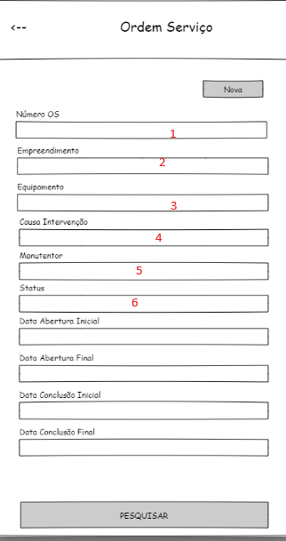

* ## API frotas- v001

#### 1. Abastecimentos

* 

##### 1.2. /api/frotas/Abastecimentos/ConsultaAbastecimento

* **Listas todos as Abastecimentos Próprios ou Postos**

```json
[
  {
    "emprdCod": 0,
    "emprDesc": "string",
    "codEquipamento": "string",
    "modelo": "string",
    "quantidade": 0,
    "valorTotal": 0,
    "entidade": 0,
    "insumoCdg": "string",
    "insumoDesc": "string",
    "dataAbastecimento": "2025-10-20T16:36:26.777Z",
    "identificador": "string",
    "localAbastecimento": "string",
    "responsavelCod": "string",
    "responsavelNome": "string",
    "placa": "string",
    "odometro": 0,
    "numVoucher": 0,
    "numRetornoPosto": 0,
    "numeroCartao": "string",
    "horimetro": 0,
    "fornecedorRazao": "string",
    "tpAbastecimento": 0,
    "codAbastecimentoExterno": "string",
    "abastecimentoId": "3fa85f64-5717-4562-b3fc-2c963f66afa6",
    "dataCadastro": "2025-10-20T16:36:26.777Z",
    "equipamentoId": "3fa85f64-5717-4562-b3fc-2c963f66afa6",
    "insumoId": "3fa85f64-5717-4562-b3fc-2c963f66afa6",
    "comboioBombaCdg": "string",
    "comboioBombaDescr": "string",
    "comboioBombaId": "3fa85f64-5717-4562-b3fc-2c963f66afa6",
    "bicoCdg": 0,
    "bicoDescr": "string",
    "bicoId": "3fa85f64-5717-4562-b3fc-2c963f66afa6",
    "fornecedorId": "3fa85f64-5717-4562-b3fc-2c963f66afa6",
    "responsavelId": "3fa85f64-5717-4562-b3fc-2c963f66afa6"
  }
]
```

** **Obs.** O Campo  tpAbastecimento = 0  --> Abastecimento próprio ,
                     tpAbastecimento = 1  --> Abastecimento em Postos

##### 1.3. API para utilização conforme layout -Pesquisa Abastecimento Próprio


* 1 - "Origem/Tanque"     --> Utilizar a  /api/frotas/Abastecimentos/ConsultaBomba
* 2 - "Equipamento"       --> Utilizar a  /api/frotas/Lookups/Equipamentos

**Utilizar a Api para consulta dos abastecimentos:  /api/frotas/Abastecimentos/ConsultaAbastecimento** com o parâmetro fixo:
"TpAbastecimento" = 0 ;

Para retornar somente os abastecimentos com a origem do App, passar o parâmetro "Origem"  = 3

##### 1.4. API para utilização conforme layout -Grava Abastecimento Próprio


* 1 - "Origem/Tanque"         --> Utilizar a  /api/frotas/Abastecimentos/ConsultaBomba
* 2 - "Equipamento"           --> Utilizar a  /api/frotas/Lookups/Equipamentos . 
* 3 - "Bico"                  --> Utilizar a  /api/frotas/Abastecimentos/ConsultaBico.  **Passar como parâmetro(Id) o bombaId selecionado na consulta da Bomba  "**
* 4 - "Destino"               --> Utilizar a  /api/frotas/Abastecimentos/ConsultaDestinoAbastecimentos **Passar como parâmetro(bombaId) o bombaId selecionado na consulta da Bomba  "**
* 5 - "Empreendimento"        --> Utilizar a  /api/cadastros/Lookups/Empreendimentos     **Carregar a Combo do empreendimento com o Emprd. de retorno da Seleção "Origem/Tanque**
* 6 - "Etapa"                 --> Utilizar a  /api/orcamentos/Lookups/Etapas  **Passar como parâmetro(empreendimentoId), selecionado na consulta do empreendimento** 
* 7 - "Insumo"                --> Utilizar a  /api/frotas/Abastecimentos/ConsultaEstoqueComboio **Passar como parâmetro(bombaId), selecionado na Consulta Bomba**
* 8 - "BombaInicial"          --> Utilizar a /api/frotas/Abastecimentos/ConsultaUltimoNumeroBico **Passar como parâmetros(bombaId e bicoId ), selecionado nas consultas ConsultaBomba e      ConsultaBico** 
* 9 - "Motorista/Operador"    --> Utilizar a /api/frotas/OrdensServico/ConsultaColaborador com o parâmetro "Classificacao" = 1
*10 - "Colaborador Frentista" --> Utilizar a /api/cadastros/Lookups/Pessoas   **Passar como parâmetro("tipoPessoa": "Funcionário")**
*11 - "Bloco"                 --> Utilizar /api/cadastros/Lookups/Unidades  **Passar como parâmetro(empreendimentoId), selecionado na consulta do empreendimento**

**** **Utilizar para Gravar Abastecimento Próprio  a  /api/frotas/Abastecimentos/GravaAbastecimento**
Parêmetros Obrigatórios para criar um Abastecimento Próprio:
{TpAbastecimento} --> 0
{DataAbastecimento}
{TpDestino}
{IdTanqueOrigem}
{IdBico}
{IdEquipamento}
{IdInsumo}
{QtdInsumo}
{Origem} --> 1


##### 1.5. API para utilização conforme layout -Pesquisa Abastecimento Posto


* 1 - "Fornecedor"      --> Utilizar a /api/cadastros/Lookups/Pessoas   **Passar como parâmetro("tipoPessoa": "Fornecedor")**
* 2 - "Equipamento"     --> Utilizar a  /api/frotas/Lookups/Equipamentos 


**Utilizar a Api para consulta dos abastecimentos:  /api/frotas/Abastecimentos/ConsultaAbastecimento** com o parâmetro fixo:
"TpAbastecimento" = 1 ;

##### 1.6. API para utilização conforme layout -Gravar Abastecimento Posto


* 1 - "Fornecedor"      --> Utilizar a /api/cadastros/Lookups/Pessoas   **Passar como parâmetro("tipoPessoa": "Fornecedor")**
* 2 - "Equipamento"     --> Utilizar a  /api/frotas/Lookups/Equipamentos 

**** **Utilizar para Gravar Abastecimento de Posto a  /api/frotas/Abastecimentos/GravaAbastecimento**
Parêmetros Obrigatórios para criar um Abastecimento Próprio:
{TpAbastecimento} --> 1
{DataAbastecimento}
{FornecedorId}
{EquipamentoId}   
{IdInsumo}
{QtdInsumo}
{PrcUniInsumo}
{IdEmprd}
{EmpresaId}
{Origem}  --> 3 


#### 2. API Comuns

##### 2.1. /api/suprimentos/Lookups/Insumos

* Lista todos os insumos de uma entidade

##### 2.2. /api/frotas/Lookups/Equipamentos

* Lista todos os equipamentos

##### 2.3. /api/cadastros/Lookups/Empreendimentos

* Lista todos os empreendimentos

#### 3. API Ordem de Serviço

##### 3.1. /api/frotas/OrdensServico/ConsultaGeralOrdensServico

##### 3.2. /api/frotas/OrdensServico/ConsultaDetOrdensServico

##### 3.3. /api/frotas/Lookups/CausaIntervencao

##### 3.4. API para utilização conforme layout -Pesquisa



* 1 - "Número Os"             --> Inserir somente o numero
* 2 - "Empreendimento"    --> Utilizar a  /api/cadastros/Lookups/Empreendimentos
* 3 - "Equipamento"          --> Utilizar a  /api/frotas/Lookups/Equipamentos
* 4 - "Causa Intervenção" --> Utilizar a  /api/frotas/Lookups/CausaIntervencao
* 5 - "Manutentor"             --> Utilizar a /api/frotas/OrdensServico/ConsultaColaborador com o parâmetro "Classificacao" = 2
* 6 - "Status"                     --> Fazer uma Combo com os Status existentes na OS.
  Codigo	Descrição do Status
  0	      Aberta
  1	      Serviço Iniciado
  2	      Serviço Concluido
  3	      Fechada
  4	      Reprov./Cancelada

**Utilizar para a consulta das OS a /api/frotas/OrdensServico/ConsultaGeralOrdensServico**

##### 3.5. API para utilização conforme layout - edição


* 1 - "Equipamento"          --> Utilizar a  /api/frotas/Lookups/Equipamentos
* 2 - "Empreendimento"       --> Utilizar a  /api/cadastros/Lookups/Empreendimentos
* 3 - "Classificação"        --> Utilizar a  /api/livrosfiscais/Lookups/ClassificacaoServico
* 4 - "Tipo"                 --> Utilizar a /api/frotas/Lookups/TipoOs
* 5 - "Causa Intervenção"    --> Utilizar a  /api/frotas/Lookups/CausaIntervencao
* 6 - "Operador/Motorista"   --> Utilizar a /api/frotas/OrdensServico/ConsultaColaborador com o parâmetro "Classificacao" = 1
* 7 - "Empreendimento"       --> Utilizar a  /api/cadastros/Lookups/Empreendimentos
* 8 - "Status"  , Combo do item 3.4.
* 9 - "Manutentor"           -->  Utilizar a /api/frotas/OrdensServico/ConsultaColaborador com o parâmetro "Classificacao" = 2

###### 3.5.1 Gravar/Update  OS  

**** **Utilizar para Gravar OS a  /api/frotas/OrdensServico/GravarOrdemServico**
Parêmetros Obrigatórios para criar uam OS:
{EquipamentoId}   --> Id do equipapamento
{Descricao}       --> Descrição da OS
{Origem}          --> Campo interno do SienconSp7,não preenchido pelo usuário para MoBile utilizar Sempre **ORIGEM =3**

 ORIGEM =0 'SP7'
 ORIGEM =1 'SP7_Automatica'
 ORIGEM =2 'SP7_Web'
 ORIGEM =3 'SP7_app'
 ORIGEM =4 'App_terc'
