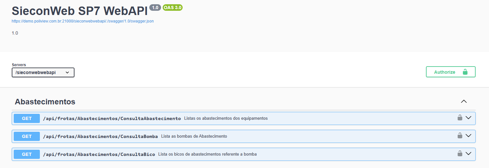
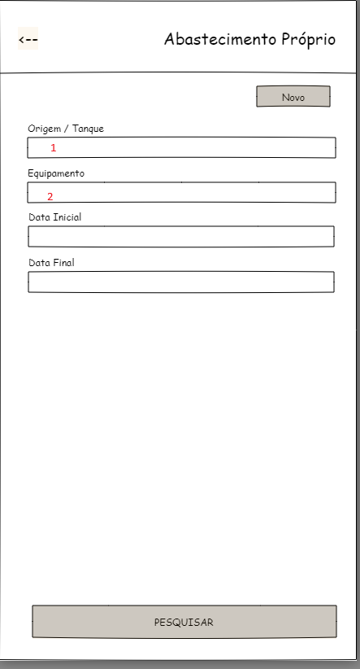
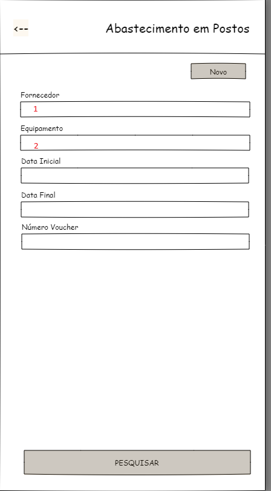
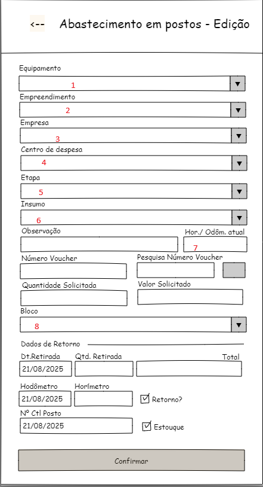
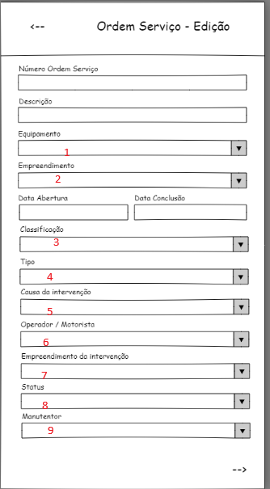
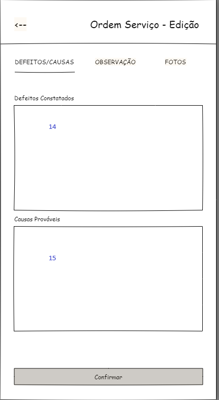
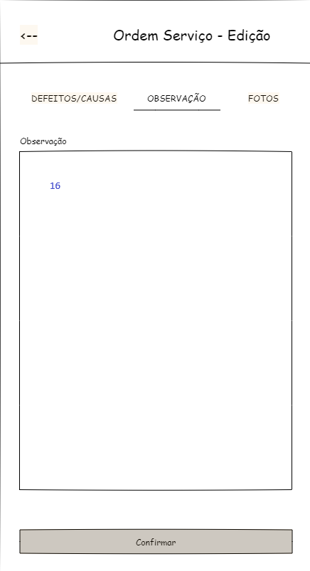
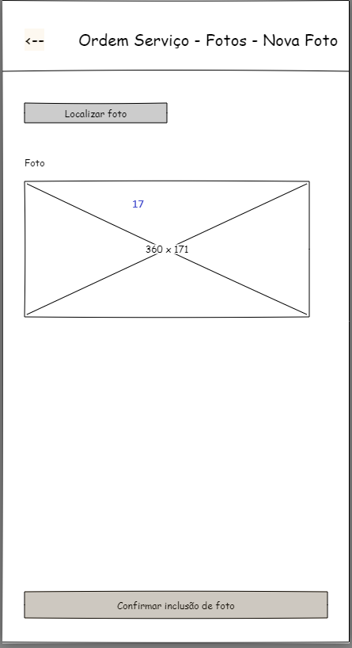

* ## API frotas- v001

#### 1. Abastecimentos

* 

##### 1.2. /api/frotas/Abastecimentos/ConsultaAbastecimento

* **Listas todos as Abastecimentos Próprios ou Postos**

```json
[
  {
    "emprdCod": 0,
    "emprDesc": "string",
    "codEquipamento": "string",
    "modelo": "string",
    "quantidade": 0,
    "valorTotal": 0,
    "entidade": 0,
    "insumoCdg": "string",
    "insumoDesc": "string",
    "dataAbastecimento": "2025-10-20T16:36:26.777Z",
    "identificador": "string",
    "localAbastecimento": "string",
    "responsavelCod": "string",
    "responsavelNome": "string",
    "placa": "string",
    "odometro": 0,
    "numVoucher": 0,
    "numRetornoPosto": 0,
    "numeroCartao": "string",
    "horimetro": 0,
    "fornecedorRazao": "string",
    "tpAbastecimento": 0,
    "codAbastecimentoExterno": "string",
    "abastecimentoId": "3fa85f64-5717-4562-b3fc-2c963f66afa6",
    "dataCadastro": "2025-10-20T16:36:26.777Z",
    "equipamentoId": "3fa85f64-5717-4562-b3fc-2c963f66afa6",
    "insumoId": "3fa85f64-5717-4562-b3fc-2c963f66afa6",
    "comboioBombaCdg": "string",
    "comboioBombaDescr": "string",
    "comboioBombaId": "3fa85f64-5717-4562-b3fc-2c963f66afa6",
    "bicoCdg": 0,
    "bicoDescr": "string",
    "bicoId": "3fa85f64-5717-4562-b3fc-2c963f66afa6",
    "fornecedorId": "3fa85f64-5717-4562-b3fc-2c963f66afa6",
    "responsavelId": "3fa85f64-5717-4562-b3fc-2c963f66afa6"
  }
]
```

** **Obs.** O Campo  tpAbastecimento = 0  --> Abastecimento próprio ,
                     tpAbastecimento = 1  --> Abastecimento em Postos

##### 1.3. /api/frotas/Abastecimentos/ConsultaBomba
* **Listas as Bombas de Abastecimentos**

```json
{
{
    "bombaCod": "string",
    "bombaDescricao": "string",
    "tipo": "string",
    "tipoDesc": "string",
    "ctrNumeracao": 0,
    "bombaNumeracao": 0,
    "bloqueado": 0,
    "bombaCodExterno": 0,
    "entidadeCod": 0,
    "empreendimentoCod": 0,
    "empreendimentoId": "3fa85f64-5717-4562-b3fc-2c963f66afa6",
    "entidadeId": "3fa85f64-5717-4562-b3fc-2c963f66afa6",
    "bombaId": "3fa85f64-5717-4562-b3fc-2c963f66afa6"
  }
}
```  
##### 1.4. /api/frotas/Abastecimentos/ConsultaBico
* **Lista os bicos de abastecimentos referente a bomba**
```json
{ 
  {
    "bicoCdg": 0,
    "bombaCod": "string",
    "bicoDescricao": "string",
    "bicoCodExterno": 0,
    "bicoId": "3fa85f64-5717-4562-b3fc-2c963f66afa6",
    "bombaDescricao": "string",
    "bombaId": "3fa85f64-5717-4562-b3fc-2c963f66afa6"
  }
}
```  
##### 1.5. /api/frotas/Abastecimentos/ConsultaDestinoAbastecimentos
* **Lista os Destinos referente ao lançamento do abastecimento **
```json
{
  {
    "destino": "EQ",
    "destinoDesc": "Equipamento",
    "destinoTipo": "M",
    "destinoid": "00000000-0000-0000-0000-000000000000",
    "emprdCod": 0,
    "emprdId": "00000000-0000-0000-0000-000000000000"
  },
  {
    "destino": "02",
    "destinoDesc": "BOMBA 002",
    "destinoTipo": "B",
    "destinoid": "7cd6573e-0853-482f-a5e5-129f9fd1b5e2",
    "emprdCod": 50,
    "emprdId": "72603b1c-7037-4bca-b74e-3267a6c6b972"
  },
  {
    "destino": "03",
    "destinoDesc": "CAMBOIO 001",
    "destinoTipo": "C",
    "destinoid": "47727e15-af67-4dad-a580-73caf5afda2d",
    "emprdCod": 50,
    "emprdId": "72603b1c-7037-4bca-b74e-3267a6c6b972"
  },
  {
    "destino": "DV",
    "destinoDesc": "Devolução Estoque emprd.",
    "destinoTipo": "D",
    "destinoid": "00000000-0000-0000-0000-000000000000",
    "emprdCod": 0,
    "emprdId": "00000000-0000-0000-0000-000000000000"
  }
  
}
```  
##### 1.6. /api/frotas/Abastecimentos/ConsultaAplicacaoPrevEquipInsumo
* **Lista todas Itens no controle de preventivo do equipamento com sua aplicação**
```json
{
   {
    "aplicacaoCdg": 0,
    "aplicacaoDescr": "string",
    "aplicacaoId": "3fa85f64-5717-4562-b3fc-2c963f66afa6",
    "insumoCod": "string",
    "insumoDesc": "string",
    "insumoId": "3fa85f64-5717-4562-b3fc-2c963f66afa6",
    "quantidade": 0
  }
}
```  
##### 1.7. /api/frotas/Abastecimentos/ConsultaEstoqueComboio
* **Lista todos os insumos que estão no estoque do Comboio**
```json
{
  {
    "insumoCdg": "03.03.0012",
    "insumoDescr": "COMBUSTIVEL (DIESEL S-10)",
    "insumoId": "9da5914f-e527-4002-a92b-3c150c30fbd6",
    "unidade": "L         ",
    "quantidade": 5000,
    "partnumber": null,
    "fabricante": null,
    "origem": 1,
    "pnsimilar": 0,
    "entidadeCod": 1,
    "entidadeId": "5bf70be2-54cb-4a52-abd5-a087c5ee6f37",
    "controleAbastecimento": 1
  }
  
}
```  
##### 1.8. /api/frotas/Abastecimentos/ConsultaUltimoNumeroBico
* **Mostra o último número  utilizado na bomba**
```json
{
   "numeracao": 0,
    "abastecimentoData": "2025-10-29T20:00:02.842Z",
    "abastecimentoCod": 0,
    "abastecimentoId": "3fa85f64-5717-4562-b3fc-2c963f66afa6"
}
```  
##### 1.9. /api/frotas/Abastecimentos/GravaAbastecimento
* **Grava o abastecimento próprio ou de posto**


##### 1.10. API's para utilização conforme layout -Pesquisa Abastecimento Próprio



* 1 - "Origem/Tanque"     --> Utilizar a  /api/frotas/Abastecimentos/ConsultaBomba
* 2 - "Equipamento"       --> Utilizar a  /api/frotas/Lookups/EquipamentosMobile

**Utilizar a Api para consulta dos abastecimentos:  /api/frotas/Abastecimentos/ConsultaAbastecimento** com o parâmetro fixo:
"TpAbastecimento" = 0 ;

Para retornar somente os abastecimentos com a origem do App, passar o parâmetro "Origem"  = 3

##### 1.11. API para utilização conforme layout -Grava Abastecimento Próprio


* 1 - "Origem/Tanque"         --> Utilizar a  /api/frotas/Abastecimentos/ConsultaBomba
* 2 - "Equipamento"           --> Utilizar a  /api/frotas/Lookups/EquipamentosMobile .
* 3 - "Bico"                  --> Utilizar a  /api/frotas/Abastecimentos/ConsultaBico.  **Passar como parâmetro(Id) o bombaId selecionado na consulta da Bomba  "**
* 4 - "Destino"               --> Utilizar a  /api/frotas/Abastecimentos/ConsultaDestinoAbastecimentos **Passar como parâmetro(bombaId) o bombaId selecionado na consulta da Bomba  "**
* 5 - "Empreendimento"        --> Utilizar a  /api/cadastros/Lookups/Empreendimentos     **Carregar a Combo do empreendimento com o Emprd. de retorno da Seleção "Origem/Tanque**
* 6 - "Etapa"                 --> Utilizar a  /api/orcamentos/Lookups/Etapas  **Passar como parâmetro(empreendimentoId), selecionado na consulta do empreendimento**
* 7 - "Insumo"                --> Utilizar a  /api/frotas/Abastecimentos/ConsultaEstoqueComboio **Passar como parâmetro(bombaId), selecionado na Consulta Bomba**
* 8 - "BombaInicial"          --> Utilizar a /api/frotas/Abastecimentos/ConsultaUltimoNumeroBico **Passar como parâmetros(bombaId e bicoId ), selecionado nas consultas ConsultaBomba e      ConsultaBico**
* 9 - "Motorista/Operador"    --> Utilizar a /api/frotas/OrdensServico/ConsultaColaborador com o parâmetro "Classificacao" = 1
* 10 - "Colaborador Frentista" --> Utilizar a /api/cadastros/Lookups/Pessoas   **Passar como parâmetro("tipoPessoa": "Funcionário")**
* 11 - "Bloco"                 --> Utilizar /api/cadastros/Lookups/Unidades  **Passar como parâmetro(empreendimentoId), selecionado na consulta do empreendimento**
* **Campo Novo -- "Aplicação"**    --> Utilizar /api/frotas/Abastecimentos/ConsultaAplicacaoPrevEquipInsumo  **Passar como parâmetro(EquipamentoId,InsumoId), selecionado na consulta do    equipamento e Insumo** , habiltar combo somente se consulta "Aplicação" retornar regsitro 
* **Campo Novo -- "Troca/Reposição"**    -->  Fazer uma Combo com "T - Troca" e "R - Reposição" , habiltar combo somente se consulta "Aplicação" retornar regsitro 

**** **Utilizar para Gravar Abastecimento Próprio  a  /api/frotas/Abastecimentos/GravaAbastecimento**
Parâmetros Obrigatórios para criar um Abastecimento Próprio:
**{TpAbastecimento} --> 0**
{DataAbastecimento} , Data do Abastecimento        (12-informado no print Grava Abastecimento Próprio)
{TpDestino}         , Destino do abastecimento     (4 - informado no print Grava Abastecimento Próprio)
{IdTanqueOrigem}    , Origem/Tanque                (1 - informado no print Grava Abastecimento Próprio)
{IdBico}            , Bico da Bomba                (3 - informado no print Grava Abastecimento Próprio)
{IdEquipamento}     , Equipamento                  (2 - informado no print Grava Abastecimento Próprio), campo Obrigatório quando destinoTipo="M"(retorno da api ConsultaDestinoAbastecimentos)
{IdInsumo}          , Insumo                       (7 - informado no print Grava Abastecimento Próprio)
{QtdInsumo}         , Quantidade Digitada          (19- informado no print Grava Abastecimento Próprio)
{Origem}   --> Campo interno do SienconSp7,não preenchido pelo usuário para MoBile utilizar Sempre **ORIGEM =3**

Parâmetros Não Obrigatórios para criar um Abastecimento Próprio:
{Horimetro}                , Horímetro Digitado        (16-informado no print Grava Abastecimento Próprio)
{Odometro}                 , Odômetro Digitado         (14-informado no print Grava Abastecimento Próprio)
{OperadorSolicitanteId}    , Motorista/Operador          (9-informado no print Grava Abastecimento Próprio)
{NumBicoInicial}           , Numero Bomba Inicial       (8-informado no print Grava Abastecimento Próprio)
{NumBicoFinal}             , Numero Bomba Final        (20-informado no print Grava Abastecimento Próprio)
{IdEmprd}                  , Empreendimento            (5-informado no print Grava Abastecimento Próprio)
**{TipoPrevAbast},         , Campo Novo                "Troca/Reposição", sendo "T" para Troca  "R" para Reposição
{AplicacaoPrevId}          , Campo Novo                "Aplicação", Utilizar o parâmetro ("aplicacaoId" do resultado da api ConsultaAplicacaoPrevEquipInsumo )**,   
{IdTanqueDestino},         , Informar resultado do campo destino a api ConsultaDestinoAbastecimentos quando destinoTipo<>"M"

##### 1.12. API para utilização conforme layout -Pesquisa Abastecimento Posto



* 1 - "Fornecedor"      --> Utilizar a /api/cadastros/Lookups/Pessoas   **Passar como parâmetro("tipoPessoa": "Fornecedor")**
* 2 - "Equipamento"     --> Utilizar a  /api/frotas/Lookups/Equipamentos

**Utilizar a Api para consulta dos abastecimentos:  /api/frotas/Abastecimentos/ConsultaAbastecimento** com o parâmetro fixo:
"TpAbastecimento" = 1 ;

##### 1.13. API para utilização conforme layout -Gravar Abastecimento Posto



* 1 - "Equipamento"        --> Utilizar a  /api/frotas/Lookups/EquipamentosMobile
* 2 - "Empreendimento"     --> Utilizar a  /api/cadastros/Lookups/Empreendimentos
* 3 - "Empresa"            --> Utilizar a  /api/cadastros/Lookups/Empresas  **Passar como parâmetro("tipoEmpresa":0)**
* 4 - "Centro de Despesa"  --> Utilizar a  /api/cadastros/Lookups/PlanoContasDespesas , utilizar como LookupKey "planoContasPadraoId" do retorno do Insumo
* 5 - "Etapa"              --> Utilizar a  /api/orcamentos/Lookups/Etapas  **Passar como parâmetro(empreendimentoId), selecionado na consulta do empreendimento**
* 6 - "Insumo"             --> Utilizar a  /api/suprimentos/Lookups/Insumos **Passar como parâmetros("empreendimentoId" selecionado em  "Empreendimento" e "somenteInsumosDeAbastecimento" = true)**
* 8.1 - "Bloco"            --> Utilizar a  /api/cadastros/Lookups/Blocos   **Passar como parâmetro("empreendimentoId")**
* Campo Novo  - "Fornecedor"         --> Utilizar a /api/cadastros/Lookups/Pessoas   **Passar como parâmetro("tipoPessoa": "Fornecedor")**


**** **Utilizar para Gravar Abastecimento de Posto a  /api/frotas/Abastecimentos/GravaAbastecimento**
Parâmetros Obrigatórios para criar um Abastecimento Posto:
**{TpAbastecimento} --> 1**
{DataAbastecimento} , Data Retirada        (13-informado no print Grava Abastecimento em posto)
{IdFornecedor}     ,  Fornecedor           (Campo Novo)
{IdEquipamento}    ,  Equipamento          (1-informado no print Grava Abastecimento em posto)
{IdEmprd}          ,  Empreendimento       (2-informado no print Grava Abastecimento em posto)
{IdEmpresa}        ,  Empresa              (3-informado no print Grava Abastecimento em posto)
{IdCentroDespesa}  ,  Centro de Despesa    (4-informado no print Grava Abastecimento em posto)
{IdEtapa}          ,  Etapa                (5-informado no print Grava Abastecimento em posto)
{IdInsumo}         ,  Insumo               (6-informado no print Grava Abastecimento em posto)
{IdBloco}          ,  Bloco                (8-informado no print Grava Abastecimento em posto)
{QtdInsumo}        ,  Quantidade Solicitada e Retirada (11 e 14 -informado no print Grava Abastecimento em posto), Informando a Quantidade Solicitada preencher a Quantidade Retirada, será a mesma 
{TotalAbastecimentoPosto} ,   Valor Solicitada e Total (12 e 15 -informado no print Grava Abastecimento em posto), Informando a Quantidade Solicitada preencher a Quantidade Retirada, será a mesma 
{Origem}  --> Campo interno do SienconSp7,não preenchido pelo usuário para Mobile utilizar Sempre **ORIGEM =3**

Parãmetros Não Obrigatórios para criar um Abastecimento Posto:
{Observacao}         ,  Observação           (7-informado no print Grava Abastecimento em posto)
{Odometro},          ,  Odômetro             (16-informado no print Grava Abastecimento em posto)
{Horimetro}          ,  Horímetro            (17-informado no print Grava Abastecimento em posto)
{NumeroControlePosto},  Nº Controle do Posto (18-informado no print Grava Abastecimento em posto) 
{Retorno}            ,  Retorno              (19-informado no print Grava Abastecimento em posto) **Default para o usuário sempre Checado =1**      0 Não Checado  e 1 Para Checado 
{Estoque}            ,  Estoque              (20-informado no print Grava Abastecimento em posto) **Default para o usuário sempre Não Checado =0**  0 Não Checado  e 1 Para Checado 

#### 2. API Comuns

##### 2.1. /api/suprimentos/Lookups/Insumos

* Lista todos os insumos de uma entidade

##### 2.2. /api/frotas/Lookups/EquipamentosMobile

* Lista todos os equipamentos

##### 2.3. /api/cadastros/Lookups/Empreendimentos

* Lista todos os empreendimentos

#### 3. API's para  Ordens de Serviço

##### 3.1. /api/frotas/OrdensServico/ConsultaGeralOrdensServico

##### 3.2. /api/frotas/OrdensServico/ConsultaDetOrdensServico

##### 3.3. /api/frotas/Lookups/CausaIntervencao


**Utilizar para a consulta das OS a /api/frotas/OrdensServico/ConsultaGeralOrdensServico**
*** campos de Retorno da API 
```
json
[
  {
    "osCod": 6,
    "osDescricao": "OS - MATS PARA CONSTRUÇÃO OF 28",
    "equipCod": "EH01",
    "equipIndentificador": "EH01",
    "equipId": "77cc4a23-601d-4734-9b0b-42da1469fdd2",
    "observacao": "OS - MATS PARA CONSTRUÇÃO OF 28",
    "obsDef": null,
    "obsCausas": null,
    "obsProvidencias": null,
    "osDataAbertura": "2022-05-30T00:00:00",
    "osDataConclusao": "0001-01-01T00:00:00",
    "osHora": "10:47:56",
    "tpServcod": 0,
    "tpServDescricao": null,
    "dataIniParaliz": "0001-01-01T00:00:00",
    "horaIniParaliz": null,
    "dataFimParaliz": "0001-01-01T00:00:00",
    "horaFimParaliz": null,
    "horimetro": 0,
    "odometro": 0,
    "codFornecedor": null,
    "nomeFornecedor": null,
    "cpfCnpgFornecedor": null,
    "nfFornecedor": null,
    "total": 0,
    "totalMaoDeObra": 0,
    "totalterial": 0,
    "totalServico": 0,
    "classifDesc": null,
    "causasCdg": 0,
    "causasDescri": null,
    "causasId": "00000000-0000-0000-0000-000000000000",
    "emprdintervencaoCod": 0,
    "emprdintervencaoId": "00000000-0000-0000-0000-000000000000",
    "statusCod": 0,
    "statusDescricao": "ABERTA             ",
    "colaboradorCod": null,
    "colaboradorNome": null,
    "colaColaboradorCpfCnpg": null,
    "colaColaboradorId": "00000000-0000-0000-0000-000000000000",
    "origemCod": 0,
    "origemDescricao": null,
    "osGarantia": 0,
    "osPrzGarantia": 0,
    "equipBloqueado": 0,
    "emprdAberturaCod": 50,
    "emprdAberturaId": "72603b1c-7037-4bca-b74e-3267a6c6b972",
    "osId": "cee437e8-0638-4157-a906-aa21694fcf37",
    "manutentorCod": null,
    "manutentorNome": null,
    "manutentorCpfCnpg": null,
    "manutentorId": "00000000-0000-0000-0000-000000000000"
  },
  {
    "osCod": 5,
    "osDescricao": "OS - MATS PARA CONSTRUÇÃO OF 28",
    "equipCod": "EH01",
    "equipIndentificador": "EH01",
    "equipId": "77cc4a23-601d-4734-9b0b-42da1469fdd2",
    "observacao": "OS - MATS PARA CONSTRUÇÃO OF 28",
    "obsDef": null,
    "obsCausas": null,
    "obsProvidencias": null,
    "osDataAbertura": "2022-05-30T00:00:00",
    "osDataConclusao": "0001-01-01T00:00:00",
    "osHora": "10:47:31",
    "tpServcod": 0,
    "tpServDescricao": null,
    "dataIniParaliz": "0001-01-01T00:00:00",
    "horaIniParaliz": null,
    "dataFimParaliz": "0001-01-01T00:00:00",
    "horaFimParaliz": null,
    "horimetro": 0,
    "odometro": 0,
    "codFornecedor": null,
    "nomeFornecedor": null,
    "cpfCnpgFornecedor": null,
    "nfFornecedor": null,
    "total": 0,
    "totalMaoDeObra": 0,
    "totalterial": 0,
    "totalServico": 0,
    "classifDesc": null,
    "causasCdg": 0,
    "causasDescri": null,
    "causasId": "00000000-0000-0000-0000-000000000000",
    "emprdintervencaoCod": 0,
    "emprdintervencaoId": "00000000-0000-0000-0000-000000000000",
    "statusCod": 0,
    "statusDescricao": "ABERTA             ",
    "colaboradorCod": null,
    "colaboradorNome": null,
    "colaColaboradorCpfCnpg": null,
    "colaColaboradorId": "00000000-0000-0000-0000-000000000000",
    "origemCod": 0,
    "origemDescricao": null,
    "osGarantia": 0,
    "osPrzGarantia": 0,
    "equipBloqueado": 0,
    "emprdAberturaCod": 50,
    "emprdAberturaId": "72603b1c-7037-4bca-b74e-3267a6c6b972",
    "osId": "b3066b73-ca4f-4907-aeee-adb4337d1019",
    "manutentorCod": null,
    "manutentorNome": null,
    "manutentorCpfCnpg": null,
    "manutentorId": "00000000-0000-0000-0000-000000000000"
  }

]
```

##### 3.5. API para utilização conforme layout - edição/Insert Aba Principal



##### 3.5.1  API para utilização conforme layout - edição/Insert Aba Defeitos/Causa



##### 3.5.2  API para utilização conforme layout - edição/Insert Aba Observação



##### 3.5.2  API para utilização conforme layout - edição/Insert Aba Fotos



 **Metodos Get's  para Carregar os Campos/Combos**

* 1 - "Equipamento"          --> Utilizar a  /api/frotas/Lookups/EquipamentosMobile
* 2 - "Empreendimento"       --> Utilizar a  /api/cadastros/Lookups/Empreendimentos
* 3 - "Classificação"        --> Utilizar a  /api/livrosfiscais/Lookups/ClassificacaoServico
* 4 - "Tipo"                 --> Utilizar a /api/frotas/Lookups/TipoOs
* 5 - "Causa Intervenção"    --> Utilizar a  /api/frotas/Lookups/CausaIntervencao
* 6 - "Operador/Motorista"   --> Utilizar a /api/frotas/OrdensServico/ConsultaColaborador com o parâmetro "Classificacao" = 1
* 7 - "Empreendimento"       --> Utilizar a  /api/cadastros/Lookups/Empreendimentos
* 8 - "Status"  , Combo do item 3.4.
* 9 - "Manutentor"           -->  Utilizar a /api/frotas/OrdensServico/ConsultaColaborador com o parâmetro "Classificacao" = 2

###### 3.5.1 Gravar/Update  OS

**** **Utilizar para Gravar OS a  /api/frotas/OrdensServico/GravarOrdemServico**
**** **Utilizar para Gravar Fotos  a  /api/frotas/OrdensServico/GravarOrdemServicoFoto**

Parâmetros Obrigatórios para criar uma OS:
{EquipamentoId}   --> Id do equipapamento   - (1-informado no print de Ordem de Serviço Edição ,Aba Principal)
{Descricao}       --> Descrição da OS       - (11-informado no print de Ordem de Serviço Edição,Aba Principal)
{Origem}          --> Campo interno do SienconSp7,não preenchido pelo usuário para Mobile utilizar Sempre **ORIGEM =3**

Parêmetros Não Obrigatórios para criar  OS:
{OsId}                    --> Id da OS - passar somente quando for edição, no Insert o método GravarOrdemServico, retorno o Id da Os Gerada
{OsDataAbertura}          --> Data de Abertura                - (12-informado no print de Ordem de Serviço Edição,Aba Principal)
{OsDataConclusao}         --> Data de Abertura                - (13-informado no print de Ordem de Serviço Edição,Aba Principal)
**{Odometro}                --> Odometro                      - Campo Novo a ser criado no PDF -- (Odômetro)** , Habitar quando tipoControle(retorno da api EquipamentosMobile) = 'A' or 'V'
**{Horimetro}               --> Horímetro                     - Campo Novo a ser criado no PDF -- (Horímetro)**, Habitar quando tipoControle (retorno da api EquipamentosMobile)= 'A' or 'H'
{Observacao}              --> Observação                      - (16-informado no print de Ordem de Serviço Edição,Aba Observação)
{ObsDef}                  --> Defeitos Constatados            - (14-informado no print de Ordem de Serviço Edição,Aba Defeitos/Causa)
{ObsCausas}               --> Causas Prováveis                - (15-informado no print de Ordem de Serviço Edição,Aba Defeitos/Causa)
{ObsProvidencias}         --> Providencias
{FornecedorId}            --> Fornecedor
{EmprdintervencaoId}      --> Empreendiemnto de Intervenção   - (7-informado no print de Ordem de Serviço Edição,Aba Principal)
{CausasId}                --> Causa da Intervenção            - (5-informado no print de Ordem de Serviço Edição,Aba Principal)
{MotoristaOperadorId}     --> Operador/Motorista              - (6-informado no print de Ordem de Serviço Edição,Aba Principal)
{EquipBloqueado}          --> Equipamento Bloqueado - 0 Não bloquedo/ 1 Bloqueado
{EmprdAberturaId}         --> Empreendiemnto de Intervenção   - (2-informado no print de Ordem de Serviço Edição,Aba Principal)
{NfFornecedor}            --> Fornecedor externo
{ManutentorResponsavelId} --> Manutentor                      - (9-informado no print de Ordem de Serviço Edição,Aba Principal)
{ClassificacaoId}         --> Classificação                   - (3-informado no print de Ordem de Serviço Edição,Aba Principal)
{TipoServicoId}           --> Tipo                            - (4-informado no print de Ordem de Serviço Edição,Aba Principal)
